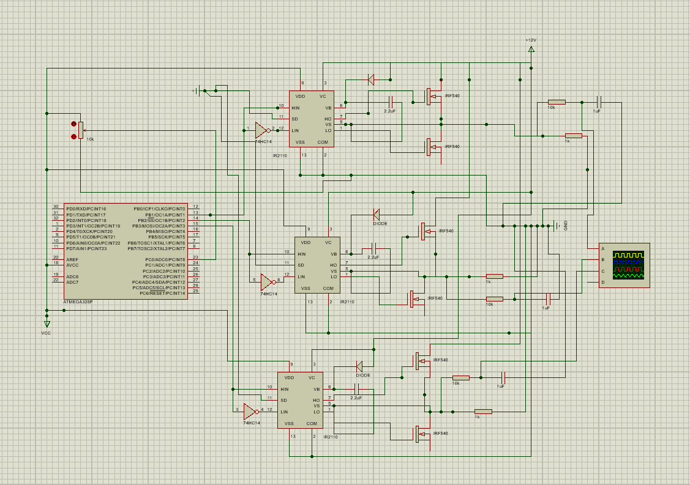
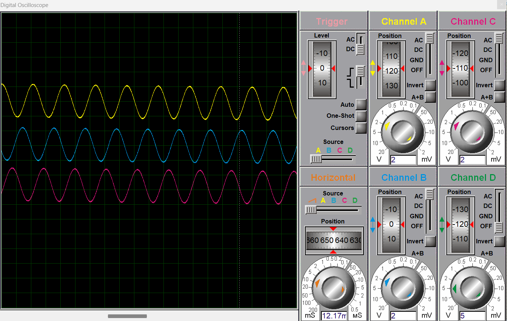

# ⚡ 3-Phase Pure Sine Wave Inverter (SPWM)

This repository contains the complete hardware schematic and embedded C firmware for a **3-Phase Full-Bridge Inverter**. The system is primarily designed for Electric Vehicle (EV) powertrain simulations, utilizing an ATmega328P to generate precise Sinusoidal Pulse Width Modulation (SPWM) signals.

## 📋 Table of Contents
1. [Project Overview](#-project-overview)
2. [Relevance to Electric Vehicles (EVs)](#-relevance-to-electric-vehicles-evs)
3. [Hardware Design](#-hardware-design)
4. [Simulation Results](#-simulation-results)
5. [Repository Structure](#-repository-structure)

## 🚀 Project Overview
The core objective of this project is to successfully drive a 3-phase load using an advanced SPWM technique. 
* **Phase Shift:** Perfect 120° displacement between all three phases.
* **Switching Frequency:** ~31.25 kHz, optimizing the balance between switching losses and harmonic distortion.
* **Control:** Timer-based interrupt generation for accurate sine wave reconstruction.

## 🚗 Relevance to Electric Vehicles (EVs)
In modern Electric Vehicles, the main power source is a DC battery pack, but the traction motors that drive the wheels are almost exclusively **3-Phase AC motors** (such as Induction or Permanent Magnet Synchronous Motors) due to their high efficiency and torque density. 

This inverter project simulates the core **Powertrain** mechanism of an EV. By converting the DC voltage into 3-phase AC using SPWM, this circuit acts as the critical bridge between the battery and the motor. Adjusting the SPWM frequency and modulation index in this system represents how the "gas pedal" controls the speed and acceleration of a real electric car.

## 🛠 Hardware Design
The power stage consists of **6x IRF540 MOSFETs** controlled by **3x IR2110 High/Low Side Gate Drivers**. 
* **Bootstrap Circuitry:** Accurately calculated bootstrap capacitors and diodes are implemented to maintain the floating supply for the high-side MOSFETs.
* **Grounding:** Proper grounding of the IR2110 Shutdown (SD) pins guarantees stable operation during simulation and prevents unwanted floating states.

## 📊 Simulation Results
The logic and power stages were rigorously tested using Proteus. The oscilloscope capture below demonstrates the clean, interleaved 3-phase SPWM signals at the output of the microcontroller.

## 📂 Repository Structure
* `/Hardware`: Proteus design files (`.dsn`).
* `/Firmware`: Source code (`.c`) and the compiled binary (`.hex`) for the ATmega328P.

---
---

# ⚡ ATmega328P ile 3-Fazlı Tam Sinüs İnvertör (SPWM)

Bu depo, bir **3-Fazlı Tam Köprü (Full-Bridge) İnvertör** sisteminin tüm donanım şemasını ve gömülü C yazılımını içermektedir. Sistem, elektrikli araç (EV) güç aktarma organları simülasyonları için tasarlanmış olup, hassas Sinüzoidal Darbe Genişlik Modülasyonu (SPWM) sinyalleri üretmek üzere ATmega328P mikrodenetleyicisini kullanır.

## 📋 İçindekiler
1. [Proje Özeti](#-proje-özeti)
2. [Elektrikli Araçlar (EV) İle Bağlantısı](#-elektrikli-araçlar-ev-i̇le-bağlantısı)
3. [Donanım Tasarımı](#-donanım-tasarımı)
4. [Simülasyon Sonuçları](#-simülasyon-sonuçları)
5. [Klasör Yapısı](#-klasör-yapısı)

## 🚀 Proje Özeti
Bu projenin temel amacı, gelişmiş bir SPWM tekniği kullanarak 3-fazlı bir yükü başarılı bir şekilde sürmektir.
* **Faz Farkı:** Üç faz arasında tam 120°'lik kusursuz açısal fark.
* **Anahtarlama Frekansı:** Anahtarlama kayıpları ve harmonik bozulma arasındaki dengeyi optimize eden ~31.25 kHz.
* **Kontrol:** Sinüs dalgasının doğru şekilde yeniden oluşturulması için Timer (zamanlayıcı) tabanlı kesme (interrupt) kullanımı.

## 🚗 Elektrikli Araçlar (EV) İle Bağlantısı
Günümüz Elektrikli Araçlarında (EV) ana güç kaynağı DC batarya paketleridir, ancak tekerleklere güç veren çekiş motorları (traction motors) yüksek verimleri ve tork yoğunlukları nedeniyle neredeyse tamamen **3-Fazlı AC motorlardır** (Asenkron veya Sabit Mıknatıslı Senkron Motorlar).

Bu invertör projesi, bir elektrikli aracın temel **Güç Aktarma Organı (Powertrain)** mekanizmasını simüle etmektedir. DC gerilimi SPWM kullanarak 3-fazlı AC'ye çeviren bu devre, batarya ile motor arasındaki kritik köprü görevi görür. Bu sistemdeki SPWM frekansını ve modülasyon indeksini ayarlamak, gerçek bir elektrikli arabada "gaz pedalının" aracın hızını ve ivmelenmesini nasıl kontrol ettiğini temsil eder.

## 🛠 Donanım Tasarımı
Güç katı, **3 adet IR2110 High/Low Side Gate Sürücü** tarafından kontrol edilen **6 adet IRF540 MOSFET**'ten oluşmaktadır.
* **Bootstrap Devresi:** Üst kol (high-side) MOSFET'lerin havada kalan (floating) beslemesini sağlamak için Bootstrap kapasitörleri ve diyotları sisteme entegre edilmiştir.
* **Topraklama:** IR2110 sürücülerinin Shutdown (SD) bacaklarının doğru şekilde topraklanması, kararlı çalışmayı garanti altına alır.

## 📊 Simülasyon Sonuçları
Lojik ve güç katmanları Proteus kullanılarak zorlu testlerden geçirilmiştir. Aşağıdaki osiloskop görüntüsü, mikrodenetleyici çıkışından alınan temiz ve birbiriyle 120 derece örtüşen 3-fazlı SPWM sinyallerini kanıtlamaktadır.

## 📂 Klasör Yapısı
* `/Hardware`: Proteus tasarım dosyaları (`.dsn`).
* `/Firmware`: ATmega328P için kaynak kod (`.c`) ve derlenmiş makine kodu (`.hex`).
